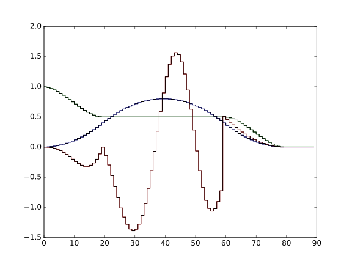

Reference Manual
================

.. _usb-protocol:

USB Protocol
------------

The data connection to a PDQ2 stack is a single, full speed USB, parallel FIFO with byte granularity.
On the host this looks like a "character device" or "serial port".
Windows users may need to install the FTDI device drivers available at the FTDI web site and enable "Virtual COM port (VCP) emulation" so the device becomes available as a COM port.
Under Linux the drivers are usually already shipped with the distribution and immediately available.
Device permissions have to be handled as usual through group membership and udev rules.
The USB bus topology or the device serial number can be used to uniquely identify and access a given PDQ2 stack.
The serial number is stored in the FTDI FT245R USB FIFO chip and can be set as described in the old PDQ documentation.
The byte order is little-endian.

Control Messages
................

The communication to the device is one-way, write-only.
Synchronization has to be achieved by properly sequencing the setting of digital lines with control commands, control commands, and memory writes on the USB bus.

Control commands apply to all channels on all boards in a stack.

Control commands on the USB bus are single bytes prefixed by the ``0xa5`` escape sequence (``0xa5 0xYY``).
If the byte ``0xa5`` is to be part of the (non-control) data stream it has to be escaped by ``0xa5`` itself.

======= ======== ===========
Name    Command  Description
======= ======== ===========
RESET   ``0x00`` Reset the FPGA registers. Does not reset memories. Does not reload the bitstream.
TRIGGER ``0x02`` Soft trigger. Logical OR with the external trigger control line to form the trigger signal to the spline.
ARM     ``0x04`` Enable triggering. Disarming also aborts parsing of a frame and forces the parser to the frame jump table. A currently active line will finish execution.
DCM     ``0x06`` Set the clock speed. Enabling chooses the Digital Clock Manager which doubles the clock and thus operates all FPGA logic and the DACs at 100 MHz. Disabling chooses a 50 MHz sampling and logic clock. The PDQ2 logic is inherently agnostic to the value of the sample clock. Scaling of coefficients and duration values must be performed on the host.
START   ``0x08`` Enable starting new frames (enables leaving the frame jump table).
======= ======== ===========

The LSB of the command byte then determines whether the command is a "disable" or an "enable" command.

Examples:

    * ``0xa5 0x02`` is ``TRIGGER`` enable,
    * ``0xa5 0x03`` is ``TRIGGER`` disable,
    * ``0xa5 0xa5`` is a single ``0xa5`` in the non-control data stream.

Memory writes
.............

The non-control data stream is interpreted as 16 bit values (two bytes little-endian).
The stream consists purely of writes of data to memory locations on individual channels.
One channel/one memory can be written to at any given time.
A memory write has the format (each line is one word of 16 bits):

+--------------------+
| ``channel``        |
+--------------------+
| ``addr``           |
+--------------------+
| ``length``         |
+--------------------+
| ``data[0]``        |
+--------------------+
| ``data[1]``        |
+--------------------+
| ...                |
+--------------------+
| ``data[length-1]`` |
+--------------------+

The channel number is a function of the board number (selected on the dial switch on each PDQ2 board) and the DAC number (0, 1, 2): ``channel = (board_addr << 4) | dac_number``.

.. warning::
    No length check or address verification is performed.
    Overflowing writes wrap.
    Non-existent or invalid combinations of board address and/or channel number are silently ignored or wrapped.
    If the write format is not adhered to, synchronization is lost and behavior is undefined.
    A valid ``RESET`` sequence will restore synchronization.
    To reliably reset under all circumstances, ensure that the reset sequence ``0xa500`` is *not* preceded by an (un-escaped) escape character.

Control commands can be inserted at any point in the non-control data stream.

Examples:

    * ``0x0072 0x0001 0x0003 0x0005 0x0007 0x0008`` writes the three words ``0x0005 0x0007 0x0008`` to the memory address ``0x0001`` of DAC channel 2 (the last of three) on board 7 (counting from 0).
    * ``0xa506 0x0000 0x00a5a5 0x0001 0xa5a5a5a5 0xa502 0xa504 0xa508`` enables the clock doubler (100 MHz) on all channels, then writes the single word ``0xa5a5`` to address ``0x00a5`` (note the escaping) of channel 0 of board 0, enables soft trigger on all channels, disarms all channels, and finally starts all channels.

.. _memory-layout:

Memory Layout
-------------

The three DAC channels on each board have 8192, 8292, 4096 words (16 bit each) capacity (16 KiB, 16 KiB, 8 KiB).
Overflowing writes wrap around.
The memory is interpreted as consisting of a table of frame start addresses with 8 entries, followed by data.
The layout allows partitioning the waveform memory arbitrarily among the frames of a channel.
The data for frame ``i`` is expected to start at ``memory[memory[i]]``.

The memory is interpreted as follows (each line is one word of 16 bits):

+-----------------------+----------------------+
| Address               | Data                 |
+=======================+======================+
| ``0``                 | ``frame[0].addr``    |
+-----------------------+----------------------+
| ``1``                 | ``frame[1].addr``    |
+-----------------------+----------------------+
| ...                   | ...                  |
+-----------------------+----------------------+
| ``frame[0].addr``     | ``frame[0].data[0]`` |
+-----------------------+----------------------+
| ``frame[0].addr + 1`` | ``frame[0].data[0]`` |
+-----------------------+----------------------+
| ...                   | ...                  |
+-----------------------+----------------------+
| ``frame[0].addr + N`` | ``frame[0].data[N]`` |
+-----------------------+----------------------+
| ...                   | ...                  |
+-----------------------+----------------------+
| ``frame[1].addr``     | ``frame[1].data[0]`` |
+-----------------------+----------------------+
| ``frame[1].addr + 1`` | ``frame[1].data[1]`` |
+-----------------------+----------------------+
| ...                   | ...                  |
+-----------------------+----------------------+
| ``frame[1].addr + L`` | ``frame[1].data[L]`` |
+-----------------------+----------------------+
| ...                   | ...                  |
+-----------------------+----------------------+

.. warning::
    * The memory layout is not enforced or verified.
    * If violated, the behavior is undefined.
    * Jumping to undefined addresses leads to undefined behavior.
    * Jumping to frame numbers that have invalid addresses written into their
      address location leads to undefined behavior.

.. note::
    This layout can be exploited to rapidly swap frame data between multiple different waveforms (without having to re-upload any data) by only updating the corresponding frame address(es).

.. _data-format:

Line Format
-----------

The frame data consists of a concatenation of lines.
Each line has the following format:

+----------------------+
| ``header``           |
+----------------------+
| ``duration``         |
+----------------------+
| ``data[0]``          |
+----------------------+
| ...                  |
+----------------------+
| ``data[length - 2]`` |
+----------------------+

.. warning::
    * If reading and parsing the next line (including potentially jumping into and out of the frame address table) takes longer than the duration of the current line, the pipeline is stalled and the evolution of the splines is paused until the next line becomes available.
    * ``duration`` must be positive.

Header
......

The ``header`` consists of:

+----------+-----------+---------+----+----+----+----+---------+-------------+-------------+----+----+----+----+----+----+
| 15       | 14        | 13      | 12 | 11 | 10 | 9  | 8       | 7           | 6           | 5  | 4  | 3  | 2  | 1  | 0  |
+==========+===========+=========+====+====+====+====+=========+=============+=============+====+====+====+====+====+====+
| ``wait`` | ``clear`` | ``end`` | ``shift``         | ``aux`` | ``silence`` | ``trigger`` | ``typ`` | ``length``        |
+----------+-----------+---------+----+----+----+----+---------+-------------+-------------+----+----+----+----+----+----+

The components of the ``header`` have the following meaning:

    * ``length``: The length of the line in 16 bit words including the duration but excluding the header.
    * ``typ``: The Spline interpolator that the data is fed into.
      ``typ == 0`` for the DC spline :math:`a(t)`,
      ``typ == 1`` for the amplitude :math:`b(t)` and phase/frequency :math:`b(t)` splines.
    * ``trigger``: Wait for trigger assertion before executing this line.
      The trigger signal is level sensitive.
      It is the logical OR of the external trigger input and the soft TRIGGER.
    * ``silence``: Disable the DAC sample and synchronization clocks during this line.
      This lowers the amount of clock feed-through and potentially the noise on the output.
    * ``aux``: Assert the digital auxiliary output during this line.
      The board's AUX output is the logical OR of all channel ``aux`` values.
    * ``shift``: Exponent of the line duration (see :ref:`features`).
      The actual duration of a line is then ``duration * 2**shift``.
    * ``end``: Return to the frame address jump table after parsing this line.
    * ``clear``: Clear the CORDIC phase accumulator upon executing this line.
      The first phase value output will be exactly the phase offset.
      Otherwise the phase output is the current phase plus the different in phase offsets between this line and the previous line.
    * ``wait``: Wait for trigger assertion before executing the next line.

.. warning::
    * Parsing a line is unaffected by it carrying ``trigger``.
      Only the start of the execution of a line is affected by it carrying
      ``trigger``.
    * Parsing the next line is unaffected by the preceding line carrying ``wait``.
      Only the start of the execution of the next line is affected by the
      current line carrying ``wait``.

Spline Data
...........

The interpretation of the sequence of up to 14 ``data`` words contained in each
line depends on the ``typ`` of spline interpolator targeted by ``header.typ``.

The ``data`` is always zero-padded to 14 words.

The assignment of the spline coefficients to the data words is as follows:

+---------+--------+---+----+---+---+---+---+---+---+--------+----+----+----+----+----+
| ``typ`` | 0      | 1 | 2  | 3 | 4 | 5 | 6 | 7 | 8 | 9      | 10 | 11 | 12 | 13 | 14 |
+=========+========+===+====+===+===+===+===+===+===+========+====+====+====+====+====+
| ``0``   | ``a0`` | ``a1`` | ``a2``    | ``a3``    |                                 |
+---------+--------+---+----+---+---+---+---+---+---+--------+----+----+----+----+----+
| ``1``   | ``b0`` | ``b1`` | ``b2``    | ``b3``    | ``c0`` | ``c1``  | ``c2``       |
+---------+--------+---+----+---+---+---+---+---+---+--------+----+----+----+----+----+

If the ``length`` of a line is shorter than 14 words, the remaining coefficients (or parts of coefficients) are set to zero.

The coefficients can be interpreted as two's complement signed integers or as unsigned integers depending depending on preference and convenience.
The word order is the same as the byte order of the USB protocol: little-endian.

The scaling of the coefficients is as follows:

    * ``a0`` is in units of ``full_scale/(1 << 16)``.
    * ``a1`` is in units of ``full_scale/(1 << (32 + shift))/clock_period``.
    * ``a2`` is in units of ``full_scale/(1 << (48 + 2*shift))/clock_period**2``.
    * ``a3`` is in units of ``full_scale/(1 << (48 + 3*shift))/clock_period**3``.
    * ``b0`` is in units of ``full_scale*cordic_gain/(1 << 16)``.
    * ``b1`` is in units of ``full_scale*cordic_gain/(1 << (32 + shift))/clock_period``.
    * ``b2`` is in units of ``full_scale*cordic_gain/(1 << (48 + 2*shift))/clock_period**2``.
    * ``b3`` is in units of ``full_scale*cordic_gain/(1 << (48 + 3*shift))/clock_period**3``.
    * ``c0`` is in units of ``2*pi/(1 << 16)``.
    * ``c1`` is in units of ``2*pi/(1 << 32)/clock_period``.
    * ``c2`` is in units of ``2*pi/(1 << (48 + shift))/clock_period**2``.
    * ``full_scale`` is 20 V.
    * The step size ``full_scale/(1 << 16)`` is 305 µV.
    * ``clock_period`` is 10 ns or 20 ns depending on the ``DCM`` setting.
    * ``shift`` is ``header.shift``.
    * ``2*pi`` is one full phase turn.
    * ``cordic_gain = 1.64676`` (see :mod:`gateware.cordic`).

.. note::
    With the default analog frontend, this means: ``a0 == 0`` corresponds to close to 0 V output, ``a0 == 0x7fff`` corresponds to close to 10V output, and ``a0 == 0x8000`` corresponds to close to -10 V output.

.. note::
    There is no correction for DAC or amplifier offsets, reference errors, or DAC scale errors.

.. warning::
    * There is no clipping or saturation.
    * When accumulators overflow, they wrap.
    * That's desired for the phase accumulator but will lead to jumps in the DC spline and CORDIC amplitude.
    * When the CORDIC amplitude ``b0`` reaches an absolute value of ``(1 << 15)/cordic_gain``, the CORDIC output becomes undefined.
    * When the sum of the CORDIC output amplitude and the DC spline overflows, the output wraps.

.. note::
    Latencies of the CORDIC path and the DC spline path are not matched.
    The CORDIC path (both the amplitude and the phase spline) has about 19 clock cycles more latency.
    This can be exploited to align the DC spline knot start and the CORDIC output change.

.. note::
    The splines stop accumulating when a line has reached its duration.
    All splines continue evolving even when a line of a different ``typ`` is being executed.
    All splines stop evolving when the current line has reached its duration and no next line has been read yet or the machinery is waiting for TRIGGER, ARM, or START.

.. note::
    The phase input to the CORDIC the sum of the phase offset ``c0`` and the accumulated phase due to ``c1`` and ``c2``.
    The phase accumulator *always* accumulates at full clock speed, not at the clock speed reduced by ``shift != 0``.
    It also never stops.
    This is in intentional contrast to the amplitude, DC spline, and frequency evolution that takes place at the reduced clock speed if ``shift != 0`` and may be paused.

.. _wavesynth-format:

Wavesynth Format
----------------

To describe a complete PDQ2 stack program, the Wavesynth format has been
defined.

    * A ``program`` is a sequence of ``frame``.
    * A ``frame`` is a concatentation of ``segments``. Its index in the program determines its frame number.
    * A ``segment`` is a sequence is ``lines``. The first ``line`` should be ``triggered`` to establish synchronization with external hardware.
    * A ``line`` is a dictionary containing the following fields:

        * ``dac_divider == 2**header.shift``
        * ``duration``: Integer duration in spline evolution steps, in units of ``dac_divider*clock_period``.
        * ``trigger``: Whether to wait for asserted trigger to execute this line.
        * ``channel_data``: Sequence of ``spline``, one for each channel.

    * ``spline`` is a dictionary containing as key a single spline to be set: either ``bias`` or ``dds`` and as its value a dictionary of ``spline_data``.
    * ``spline_data`` is a dictionary that may contain the following keys:

        * ``amplitude``: The uncompensated polynomial spline amplitude coefficients.
          Units are Volts and powers of ``1/(dac_divider*clock_period)`` respectively.
        * ``phase``: Phase/Frequency spline coefficients.
          Only valid if the key for ``spline_data`` was ``dds``.
          Units are ``[turns, turns/clock_period, turns/clock_period**2/dac_divider]``.
        * ``clear``: ``header.clear``.
        * ``silence``: ``header.silence``.

.. note::
    * ``spline`` has exactly one key.
    * ``amplitude`` and ``phase`` spline coefficients can be truncated. Lower
      order splines are then executed.

Example Wavesynth Program
.........................

The following example wavesynth program configures a PDQ2 stack with a single board, three DAC channels.

It configures a single frame (the first and only) consisting of a single triggered segment with three lines. The total frame duration is 80 cycles. The following waveforms are emitted on the three channels:

    * A quadratic smooth pulse in bias amplitude from 0 to 0.8 V and back to zero.
    * A cubic smooth step from 1 V to 0.5 V, followed by 40 cycles of constant 0.5 V 
      and then another cubic step down to 0 V.
    * A sequence of amplitude shaped pulses with varying phase, frequency, and chirp.

::

    wavewynth_program = [
        [
            {
                "trigger": True,
                "duration": 20,
                "channel_data": [
                    {"bias": {"amplitude": [0, 0, 2e-3]}},
                    {"bias": {"amplitude": [1, 0, -7.5e-3, 7.5e-4]}},
                    {"dds": {
                        "amplitude": [0, 0, 4e-3, 0],
                        "phase": [.25, .025],
                    }},
                ],
            },
            {
                "duration": 40,
                "channel_data": [
                    {"bias": {"amplitude": [.4, .04, -2e-3]}},
                    {"bias": {
                        "amplitude": [.5],
                        "silence": True,
                    }},
                    {"dds": {
                        "amplitude": [.8, .08, -4e-3, 0],
                        "phase": [.25, .025, .02/40],
                        "clear": True,
                    }},
                ],
            },
            {
                "duration": 20,
                "channel_data": [
                    {"bias": {"amplitude": [.4, -.04, 2e-3]}},
                    {"bias": {"amplitude": [.5, 0, -7.5e-3, 7.5e-4]}},
                    {"dds": {
                        "amplitude": [.8, -.08, 4e-3, 0],
                        "phase": [-.25],
                    }},
                ],
            },
        ]
    ]

The following figure compares the output of the three channels as simulated by the ``artiq.wavesynth.compute_samples.Synthesizer`` test tool with the output from a full simulation of the PDQ2 gateware including the host side code, control commands, memory writing, memory parsing, triggering and spline evaluation.

    PDQ2 and ``Synthesizer`` outputs for wavesynth test program.

    The abcissa is the time in clock cycles, the ordinate is the output voltage of the channel.

    The plot consists of six curves, three colored ones from the gateware simulation of the board with three channels and three black ones from the ``Synthesizer`` verification tool. The colored curves should be masked by the black curves up to integer rounding errors.

    The source of this unittest is part of ARTIQ at ``artiq.test.test_pdq2.TestPdq2.test_run_plot``.
